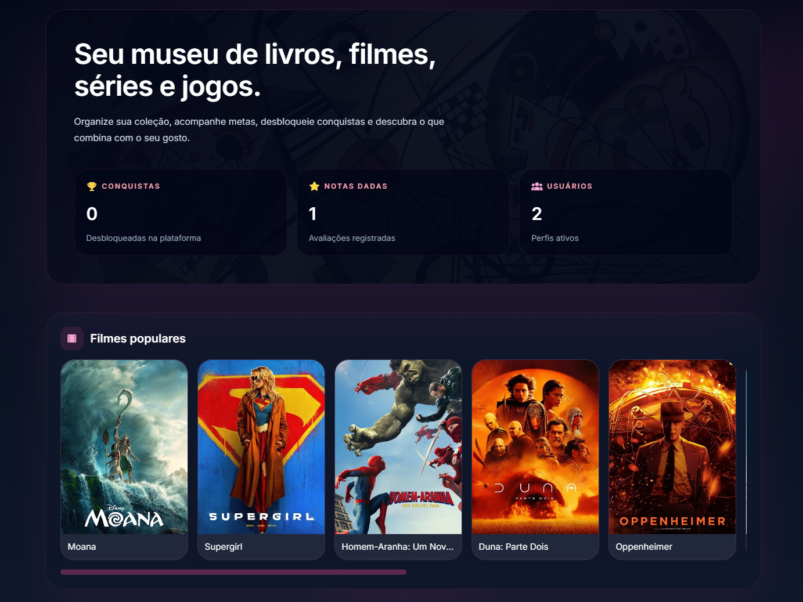

# My Museum

Build Status




MyMuseum é uma plataforma social onde usuários podem construir seu próprio museu pessoal de entretenimento.

É possível catalogar livros, filmes, séries e jogos, criar metas, desbloquear conquistas, dar notas, seguir outros usuários, sincronizar bibliotecas externas (Steam) e receber recomendações personalizadas.

O projeto foi desenvolvido como portfólio utilizando uma arquitetura moderna baseada em Spring Boot e Angular.
**Stack:** Java 25 · Spring Boot 4 · PostgreSQL · Redis · JWT · Docker · GitHub Actions

## Rodando local

```bash
# Variáveis (application-dev.yml)
DB_PASSWORD=postgres
JWT_SECRET=<base64 com pelo menos 256 bits>
MAIL_USERNAME=
MAIL_PASSWORD=

# Opcionais: TMDB, Google Books, RAWG, Steam, Riot, Cloudinary

mvn spring-boot:run
```

Front Angular em `http://localhost:4200` com proxy `/api` → `http://localhost:8080`.

## Banco

Flyway aplica as migrations na subida:

| Arquivo | Conteúdo |
|---------|----------|
| `V1__init_schema.sql` | Schema completo |
| `V2__seed_data.sql` | Usuário admin + conquistas |
| `V3__seed_book_catalog.sql` | Catálogo editorial de livros |

**Reset do banco (dev):** dropar e recriar `my_museum`, depois subir a aplicação.

## Estrutura

```
src/main/java/com/giunei/my_museum/
├── common/         config, security, exception, persistence, websocket, storage
├── auth/
├── user/
├── profile/
├── social/         follow + profile comments
├── preference/
├── media/
├── book/ movie/ series/ game/
├── recommendation/
├── achievement/
├── home/
└── integration/    APIs externas (ex.: LoL/Riot)
```

Cada módulo segue `controller` → `service` → `repository` / `entity` / `dto` quando aplicável.

Convenções detalhadas: [docs/CONVENTIONS.md](docs/CONVENTIONS.md).

## API

Ver [docs/API.md](docs/API.md).

Autenticação: `Authorization: Bearer <accessToken>`. Refresh em `POST /auth/refresh`.

## Testes

```bash
mvn test
```

## Funcionalidades

- Login JWT
- Cadastro de usuários
- Perfil público e privado
- Sistema de seguidores
- Comentários em perfis
- Biblioteca pessoal
- Livros
- Filmes
- Séries
- Jogos
- Avaliação em notas
- Conquistas
- Metas
- Recomendações
- Integração Steam
- Integração Google Books
- Integração TMDB
- Cache Redis
- Upload de imagens
## Deploy

Frontend
Vercel

Backend
Railway

Banco
Neon

Cache
Redis (Upstash)

## Autor

Desenvolvido por

Giunei Philippi Machado Júnior

LinkedIn: https://www.linkedin.com/in/giunei/

Email: pmjgiunei@gmail.com